# D&D Dungeon Party

The D&D Campaign Party is a website created to allow users to Create a campaign (A party with a minimum of 3 players to a maximum of 8 players) and then Book a venue where they can host their Campaign. This website would typically be used by players that do not have the accommodation for all the people in their campaign.

Users will also be able to view all the upcoming campaigns that the users have created. The user will not have to log in or create an account to view these campaigns, however, the user will have to create or login to an account to book a venue.

If the user have created an account, they will have access to creating a campaign, booking a venue. The users will also be able to view, edit and delete the campaigns and venues that they have created.
***
## Table of Contents

1. [User Experience (UX)](#user-experience-ux)
    1. [Strategy](#strategy)
        * [Project Goals](#project-goals)
        * [User Goals](#user-goals)
    2. [User Stories](#user-stories)
    3. [Skeleton](#skeleton)
    4. [Surface](#surface)
    5. [Features](#features)
        * [General](#general)
        * [Upcoming Campaigns](#upcoming-campaigns-page)
        * [Create Campaigns](#create-campaign-page)
        * [Venues](#venues-page)
        * [Dashboard](#dashbaord-page)
    6. [Technologies Used](#technologies-used)
        * [Languages Used](#languages-used)
        * [Libraries and Frameworks](#libraries-and-frameworks)
        * [Packages / Dependecies Installed](#packages--dependecies-installed)
        * [Database Management](#database-management)
        * [Tools and Programs](#tools-and-programs)
    7. [Testing](#testing)
        - [Bugs]()
    8. [Deployment](#deployment)
    9. [Finished Product](#finished-product)
    10. [Credits](#credits)
***

## User Experience (UX)

### Strategy

#### Project Goals

* The website contains dark themed colors that were inspired by [D&D Beyond](https://www.dndbeyond.com/).
* Responsive design to make the website accessible on different screen sizes.
* The Structure is easy to understand and navigates effortlessly.
* Site users are able to register an account in order to interact with the content.
* Site users are able to create multiple campaigns with a name, dungeon Master, total Players that will attend and a description.
* Site users are able to book a venue with their campaigns at the desired location.
* Site users, when logging in, will be able to view their dashboard, this is where they will be able to view, edit or delete the campaigns they have created.
* Site users will be able to view the upcoming campaigns, that users with accounts, have created.
***
#### User Goals

* As a Site Admin, I want to manage the site content.
* As a Site User, I want to be able to interact with the content.
* As a Site User, I want the information to be easy to find and read.
* As a Site User, I can create new campaigns.
* As a Site User, I can book a venue with the campaigns that I created.
* As a Site User, I want to manage the content I created.
***
#### User Stories

GitHub projects was used as my project management tool to track user stories. It was quite difficult for me to get use to using the story board, as I am not use to using it.

**Start**

**Week 1**

**Week 2**
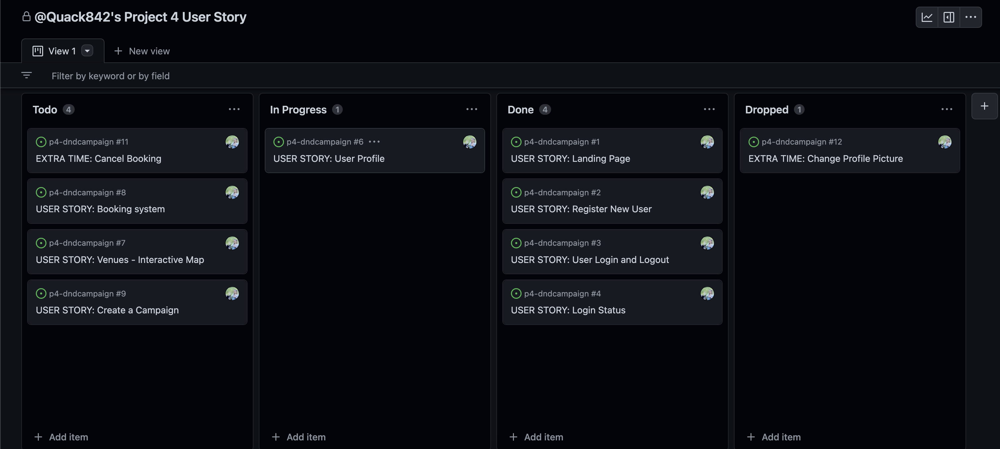

**Week 4**

**Week 5**

**Week 6**

[Back to top ⇧](#dd-dungeon-party)
***
#### Database Model

The database model has been designed using [drawsql](https://drawsql.app/). The type of database being used for the is relational database being managed using [PostgreSQL](https://www.postgresql.org/).

**Campaign Model**

* *Campaign Name*: Unique Campaign name provided by the user that's logged in.
* *Dungeon Master*: The Dungeon Master's name would be entered, it does not have to be unique.
* *Total Players*: Intiger of a minimum of 3 and maximum of 8 players.
* *Description*: Summernote style description field.
* *Created On*: Auto Date and Time Field of when the campaign was created.
***
**Booking Venue Model**

* *Campaigns*: Choice field of the existing campaigns that the user have created.
* *Venue*: A Choice field where the user can select the available venues.
* *Total Players*: Intiger with a minimum of 3 and maximum of 8 players.
* *Description*: Summernote style description field.

[Back to top ⇧](#dd-dungeon-party)
***
### Skeleton

#### Wireframes

[Invision](https://www.invisionapp.com/) has been used to showcase the appearance of the site and display the placement of the different elements within the pages. It is an alternative of the typical Balsamic that Code Institute recommends, personally, I like InVision a little more since I'm used to using it in everyday life.

Page | Desktop Version | Mobile Version
--- | --- | ---
Landing Page |  | 
Register Page |  | 
Log In |  | 
Profile |  | 
Dashboard |  | 
Upcoming Campaigns |  | 
Create Campaign |  | 
Venue |  | 

[Back to top ⇧](#dd-dungeon-party)
***
### Surface

#### Color Scheme

The Colors used in this website was inspired by the [D&D Beyond](https://www.dndbeyond.com/) website. It is a dark color scheme with red as the secondary color. I added the gold color for the borders on the buttons.

The Navigation bar is an almost black color (#191919), there is a dark themed background image used as a type of hero image, this image was selected from the website [Unsplash](https://unsplash.com/). The background has a mid section with a gray color (#484848), and the footer is the same color has the navigation bar. Because the website is based on a dark theme, the header, footer and where ever the backgrounds are dark, the font color is a gray-ish white #d5d5d5.

Some of the buttons on the forms, have the blue color (#0640c5), personally, I think it adds a pleasent break from the dark and red theme and complements the color scheme well.
***
#### Typography

The main font being used in the site is Mitr, with sans-serif as a fallback in case Mitr doesn't get imported correctly. Russo One, with sans-serif as a fallback, is used mainly for headings. Kanit was used as a 'special' font, so it was only used on the navigation bar and the buttons.

[Back to top ⇧](#dd-dungeon-party)
## Features

### General

* The website was originally designed for a desktop screen size.
* There is a responsive design for all screen sizes.
* Navigation Bar

* Contains the main logo and section links.
* The navigation bar contains links to all sections to facilitate navigation across the site. I chose not to add a hover effect to the navigation bar as I felt like it was un needed and would be too much.

* Footer

* The footer includes social links to 4 different social websites. The footer resembles the design of my first project for code institute [My Perfect Holiday and Safari](https://quack842.github.io/my-perfect-holiday/)

### Upcoming Campaigns Page

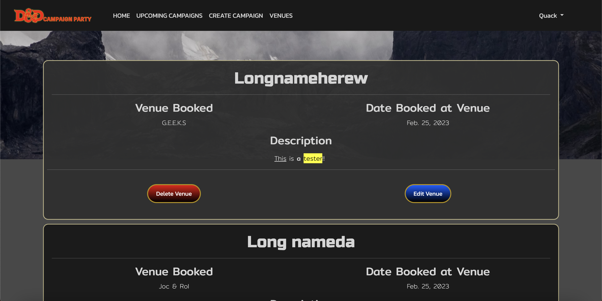

* Display a list of all the campaigns that users have created with venues.
* The user that is logged in will be able to edit and delete the venue they have created, they will not be able to edit or or delete the other campaigns.
* The user will not have to be logged in to view the upcoming campaigns.
* The venues that was booked with campaigns, will be displayed with the most recent date at the top.

### Create Campaign Page

* User will be able to create a campaign on this page.
* User will have to give a unique name for their campaign.
* There can be a minimum of 3 and a maximum of 8 players
* The user will be able to leave a comment/details about the campaign if they want to.

### Venues Page

* The user will be able to interact with the map (When on Desktop) and view all the available venues at each country that has a color.
* When the user wants to book a venue with their campaign, they will be able to select one of the available venues.
* After selecting a venue, user will then be able to select one of the campaigns they have created.
* Users will be able to select the date they want to book the venue.

### Dashbaord Page

* The user will be able to view all the campaigns they have created on the dashboard.
* The user will have the option to edit the campaigns with a form.
* The user will have the option to delete their campaigns.

[Back to top ⇧](#dd-dungeon-party)
***

## Technologies Used

### Languages Used

* [HTML5](https://en.wikipedia.org/wiki/HTML)
* [CSS3](https://en.wikipedia.org/wiki/CSS)
* [JavaScript](https://en.wikipedia.org/wiki/JavaScript)
* [Python](https://en.wikipedia.org/wiki/Python_(programming_language))
***
### Libraries and Frameworks

* [Django](https://www.djangoproject.com/)   
    * Django was used as web framework.
* [Django Template](https://jinja.palletsprojects.com)  
    * Django Template was used as a templating language for Django to display backend data to HTML.
* [Bootstrap](https://getbootstrap.com/docs/5.0/getting-started/introduction/)  
    * Bootstrap 5 was used throughout the website to help with styling and responsiveness.
* [Google Fonts](https://fonts.google.com)  
    * Google fonts was used to import the fonts into the html file, and were used on all parts of the site.
* [Font Awesome](https://fontawesome.com)  
    * Font Awesome was used throughout the website to add icons for aesthetic and UX purposes.
***
### Packages / Dependecies Installed
* [Django Allauth](https://django-allauth.readthedocs.io/en/latest/)  
    * Django Allauth was used for user authentication, registration, and account management.
* [Django Crispy Form](https://django-crispy-forms.readthedocs.io/en/latest/)   
    * Django Crispy Form was used to control the rendering of the forms. 
* [Gunicorn](https://gunicorn.org/)  
    * Gunicorn was used as Python WSGI HTTP Server for UNIX to support the deployment of Django application.  
* [Summernote](https://summernote.org/) 
    * Summernote has been used as WYSIWYG editor.
* [Cloudinary](https://cloudinary.com/)
    * Cloudinary has been used as image management solution
***
### Database Management
* [Heroku Postgres](https://www.heroku.com/postgres)   
    * Heroku Postgres database was used in production, as a service based on PostgreSQL provided by Heroku.
***
### Tools and Programs
* [GitPod](https://gitpod.io/)
    * GitPod was used for writing code, committing, and then pushing to GitHub.
* [GitHub](https://github.com)  
    * GitHub was used to store the projects code after being pushed from Git. 
* [Heroku](https://www.heroku.com)   
    * Heroku was used to deploy the website.
* [Am I Responsive](ami.responsivedesign.is)  
    * Am I Responsive was used to preview the website across a variety of popular devices.
* [Invision](https://www.invisionapp.com/)
    * Invision was used to create the wireframes during the design phase of the project. It is an alternative to the Balsamic app that code Institute recommend.
* [Chrome DevTools](https://developer.chrome.com/docs/devtools/)
    * Chrome DevTools was used during development process for code review and to test responsiveness.
* [W3C Markup Validator](https://validator.w3.org/)
    * W3C Markup Validator was used to validate the HTML code.
* [W3C CSS Validator](https://jigsaw.w3.org/css-validator/)
    * W3C CSS Validator was used to validate the CSS code.
* [JSHint](https://jshint.com/) 
    * The JSHints JavaScript Code Quality Tool was used to validate the site's JavaScript code.
* [Favicon.cc](https://www.favicon.cc/) 
    * Favicon.cc was used to create the site favicon.

[Back to top ⇧](#dd-dungeon-party)

## Testing

The testing documentation can be found [here](https://github.com/Quack842/p4-dndcampaign/blob/main/TESTING.md).

### Bugs
    This is My second upload, the first one had a bug where any user (That was not logged in) can access the create_campaign page, I fixed this by adding the login_required, before the Urls links in the urls.py file. I also added a 404 page.

    While I was add it, there was a bug that when a user created a campaign, it would not load in the create venue form, for a while. A user had to log out and in to see it again. I added the following Code to make sure that the newest campaigns created was there.

### Existing Bugs
    Currently, the user can see all the campaigns that was created by all the other users. This is a known bug and will be worked on in the future.

[Back to top ⇧](#dd-dungeon-party)

## Deployment

This project was developed using a [GitPod](https://gitpod.io/) workspace. The code was commited to [Git](https://git-scm.com/) and pushed to [GitHub](https://github.com/") using the terminal.

### Deploying on Heroku
To deploy this page to Heroku from its GitHub repository, the following steps were taken:

1. Create the Heroku App:
    - Select "Create new app" in Heroku.
    - Choose a name for your app and select the location.

2. Attach the Postgres database:
    - In the Resources tab, under add-ons, type in Postgres and select the Heroku Postgres option.

3. Prepare the environment and settings.py file:
    * In the Settings tab, click on Reveal Config Vars and copy the url next to DATABASE_URL.
    * In your GitPod workspace, create an env.py file in the main directory. 
    * Add the DATABASE_URL value and your chosen SECRET_KEY value to the env.py file.
    * Add the SECRET_KEY value to the Config Vars in Heroku.
    * Update the settings.py file to import the env file and add the SECRETKEY and DATABASE_URL file paths.
    * Update the Config Vars with the Cloudinary url, adding into the settings.py file also.
    * In settings.py add the following sections:
        * Cloudinary to the INSTALLED_APPS list
        * STATICFILE_STORAGE
        * STATICFILES_DIRS
        * STATIC_ROOT
        * MEDIA_URL
        * DEFAULT_FILE_STORAGE
        * TEMPLATES_DIR
        * Update DIRS in TEMPLATES with TEMPLATES_DIR
        * Update ALLOWED_HOSTS with ['app_name.heroku.com', 'localhost']

4. Store Static and Media files in Cloudinary and Deploy to Heroku:
    - Create three directories in the main directory; media, storage and templates.
    - Create a file named "Procfile" in the main directory and add the following:
        - web: gunicorn project-name.wsgi
    - Go to Deploy tab on Heroku and connect to the GitHub, then to the required recpository.
    Click on Delpoy Branch and wait for the build to load. When the build is complete, the app can be opened through Heroku.

[Back to top ⇧](#dd-dungeon-party)

## Finished Product

Page | Desktop | Mobile |
--- | --- | --- |
| Landing Page | 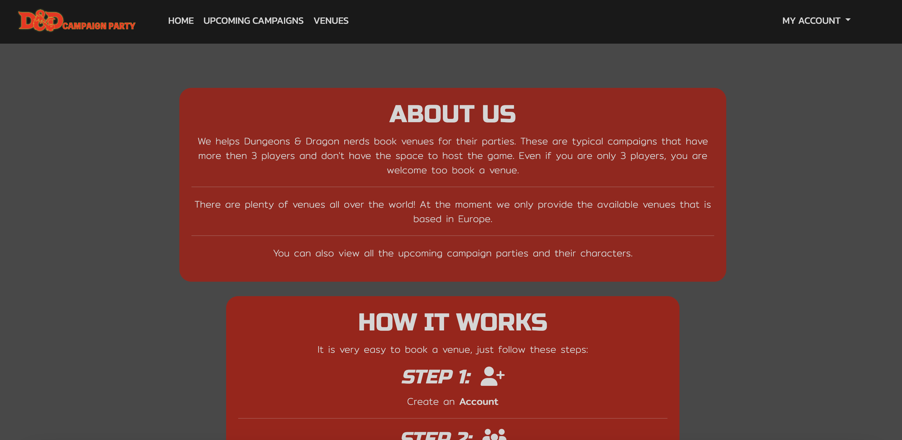 | 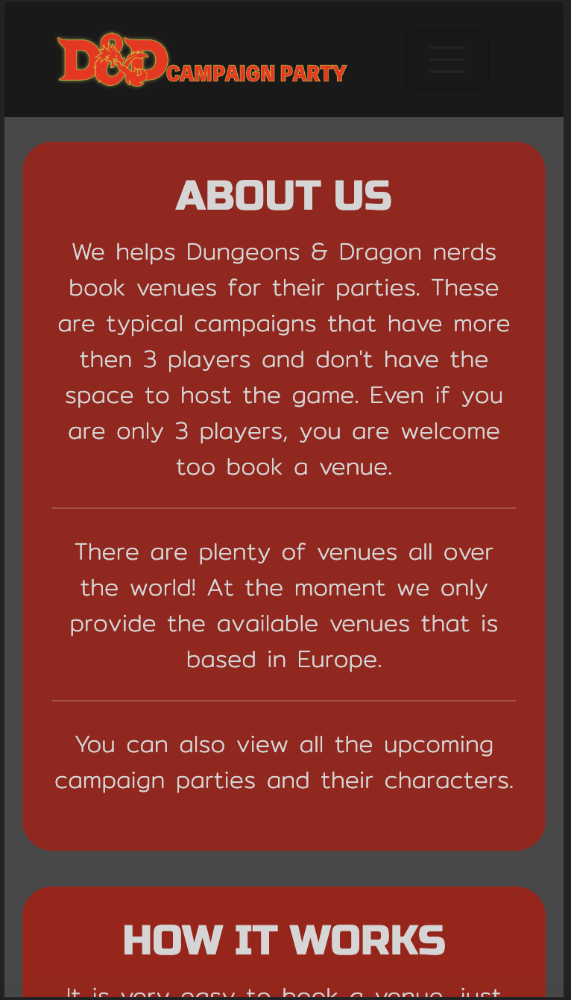 |
| Upcoming Campaigns | 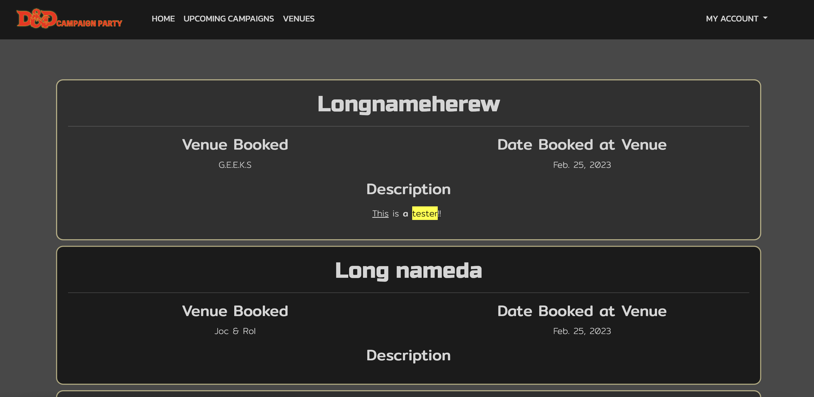 | 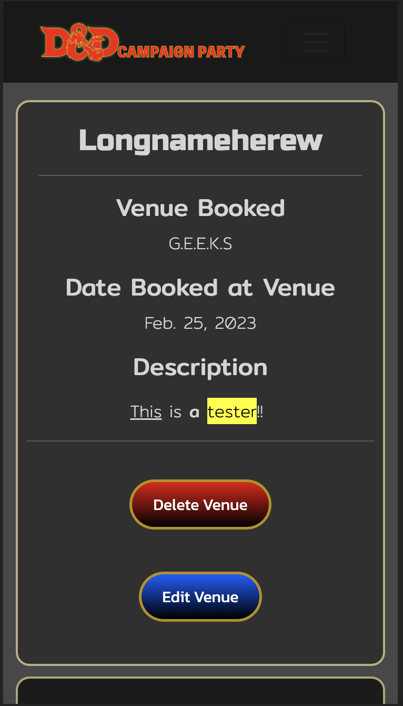 |
| Venues | 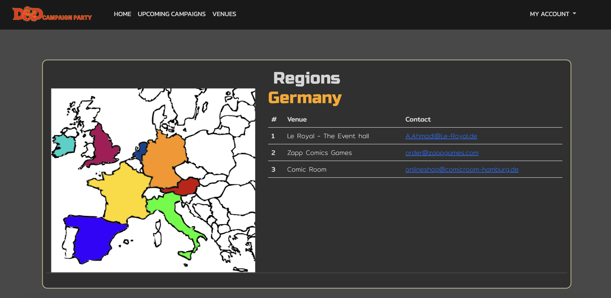 | 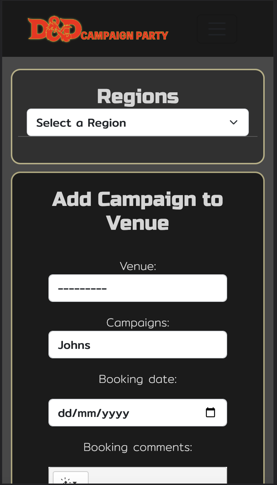 |
| Create Campaign | 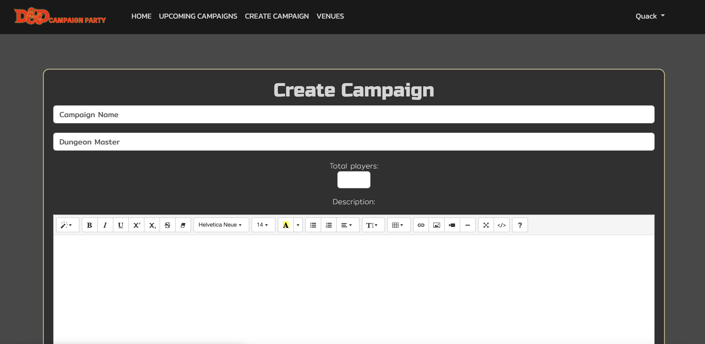 | 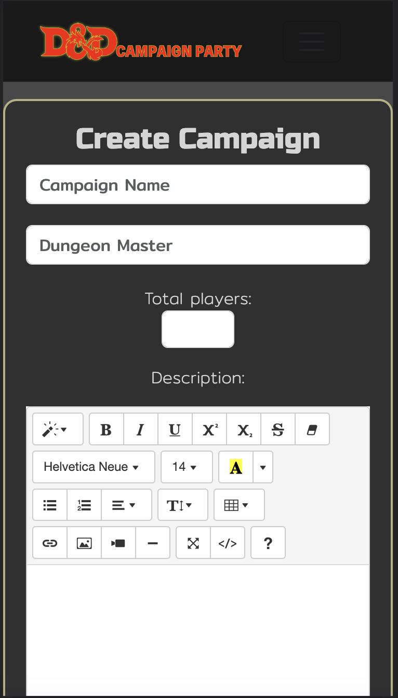 |
| Profile | 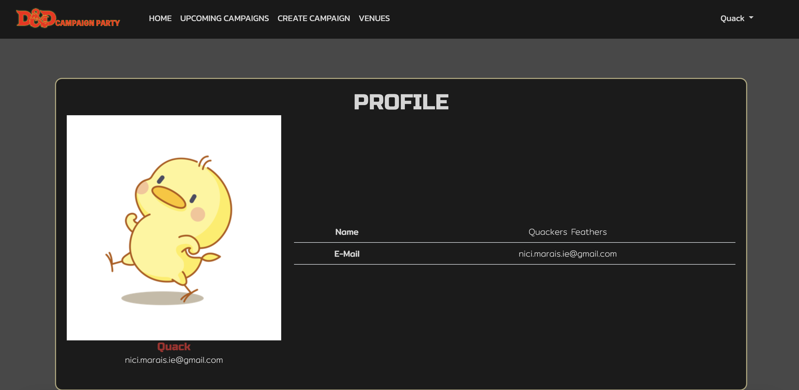 | 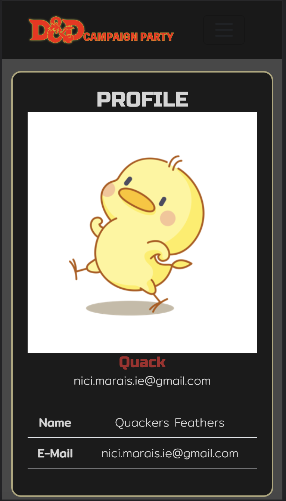 |
| Dashboard |  |  |
| Sign Up |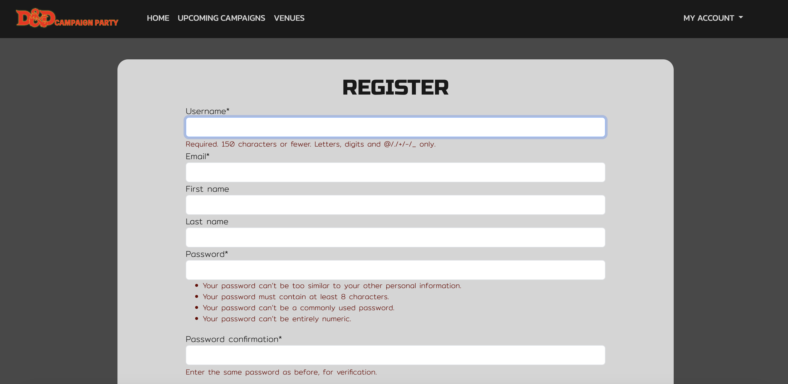 | 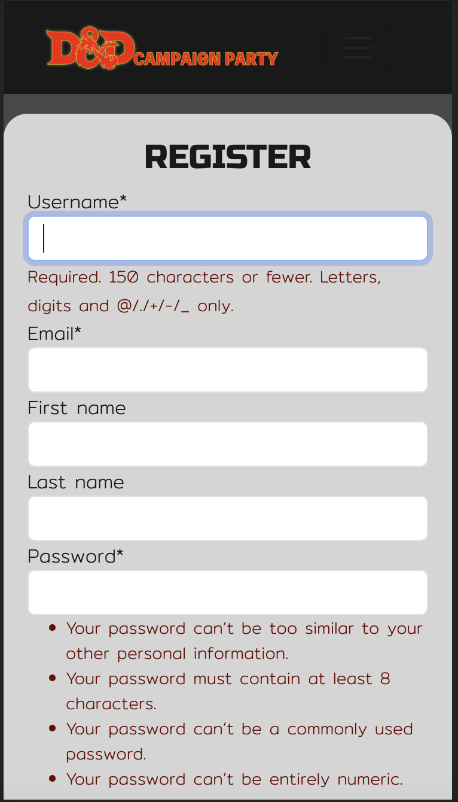 |
| Sign In |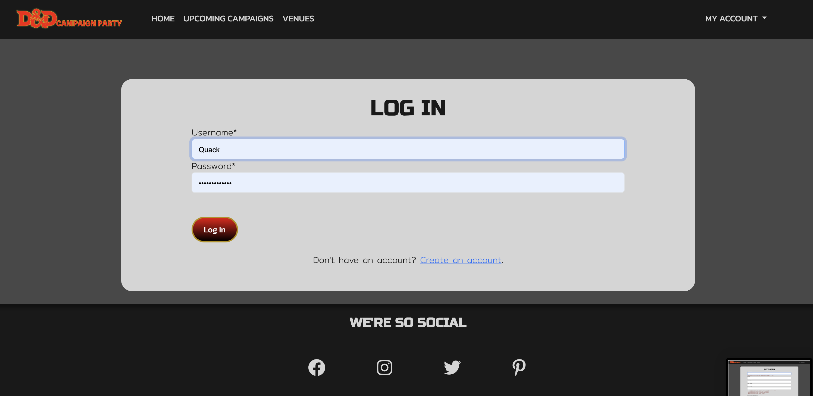 | 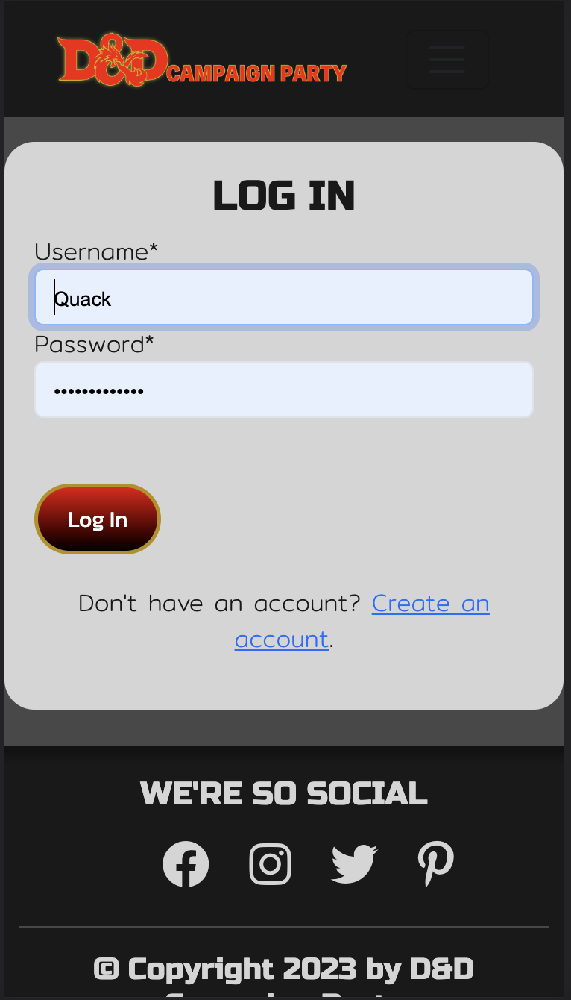 |

[Back to top ⇧](#dd-dungeon-party)

## Credits

### Code

* Stack Overflow
* [Booking system](https://blog.devgenius.io/django-tutorial-on-how-to-create-a-booking-system-for-a-health-clinic-9b1920fc2b78)
* [Date Picker](https://github.com/monim67/django-flatpickr)
* [HTML Image Maping](https://www.w3schools.com/html/html_images_imagemap.asp)
* [Area coordinator](https://www.w3schools.com/tags/att_area_coords.asp)

[Back to top ⇧](#dd-dungeon-party)

## Acknowledgements

* All the tutor, that helped with the project and fixed bugs (Named at the top)
* josswe26, and his README file that helped me get a layout and what to put in my README and TESTING Files

[Back to top ⇧](#dd-dungeon-party)