# D&D Dungeon Party Testing

[Back to the README.md file](https://github.com/Quack842/p4-dndcampaign#dd-dungeon-party)  

[Back to the Testing section in the README.md file](https://github.com/Quack842/p4-dndcampaign#testing)

[View the live website here]()

# NOTE** 
Unfortunatly, the website is not live on Heroku because the build kept failing.

I am extremely greatful for the help and time these tutors spend spend on me to try and solve this, It is a shame we coulnd't end up solving the issue. 

When deplaying to Heroku, I kept getting a 'etag' KeyError.
The 4 different Tutors who tried to help me:
1. Sean
2. Ed
3. Oisen
4. Martin

The follwong was done to try and resolve this build error:

| Tutor Suggestion | Steps tooked |
| --- | --- |
| 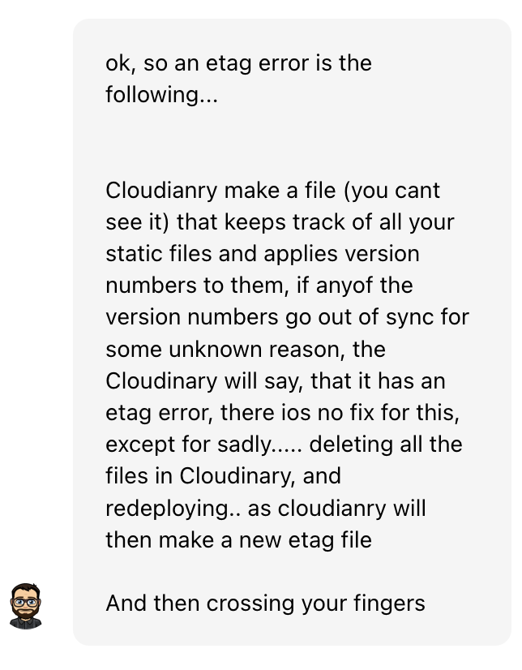 | I did exactly as told, deleted all the files on Cloudinary and re-build on Heroku, unfortunatly, It didn't work |
|  | Next Sean asked if the DISABLE_COLLECTSTATS in the cvars was deleted, and It already was. 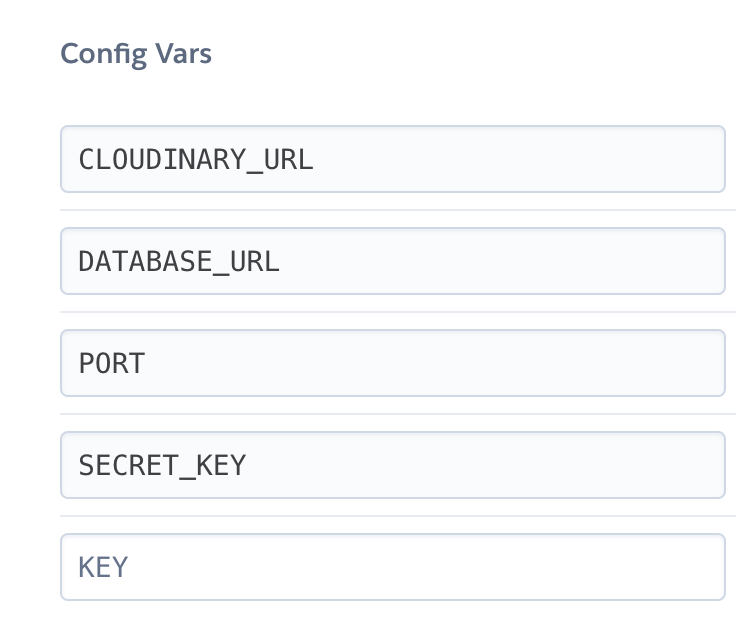
|  | Next Sean tried to run himself on my gitpod that I shared to allow him to help me, I ensure to him that I deleted the files by explaining how I did it and I sent him a screenshot if the Cloudinary with no files in. He got the same error. He sugested to try and deploy again, however, he could see himself that it failed again |
| 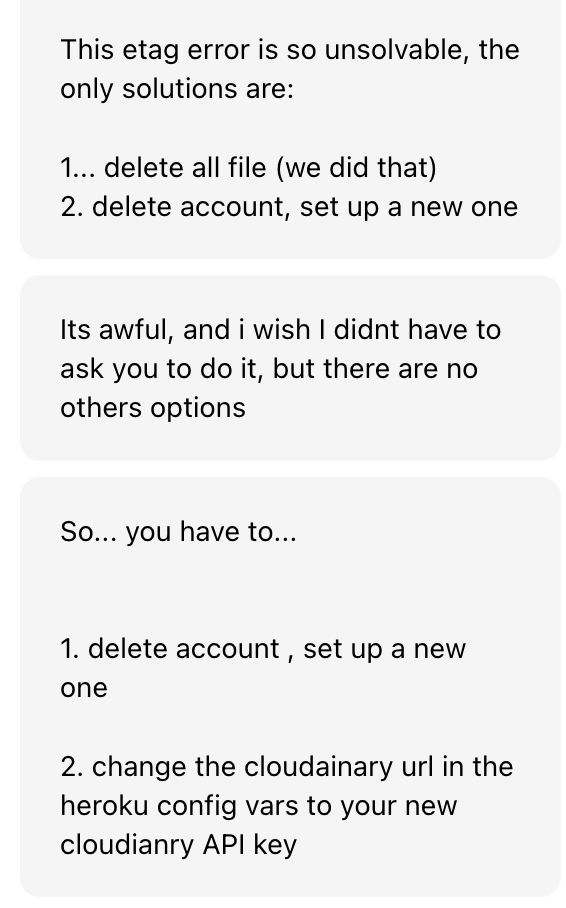 | Sean was very apologetic to say that the only other solution was to delete my cloudinary account and create a new key. I did as told and deleted my cloudinary account that was logged to my github account, and created a new account with a different email address. How ever, this still didn't fix the problem and errorKey |
| 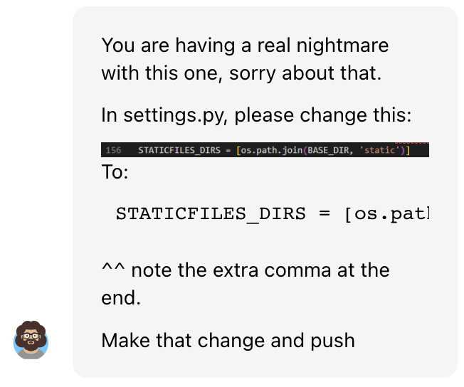 | Next to struggle with me was Ed, he suggested that I add a ", " after the staic file. I did as told, as still 'etag' error |
| 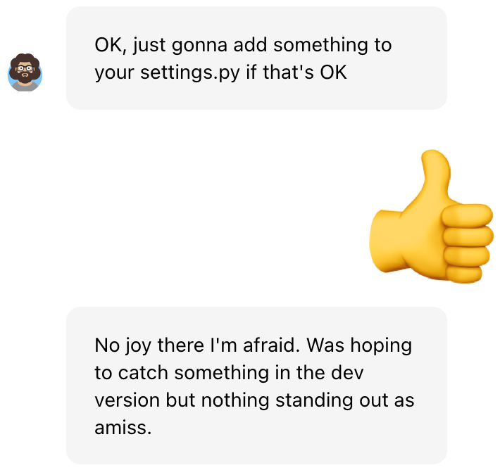 | Ed asked if he could try something in the settings.py file and see if he could figure something out and help, but to no avail. |
| 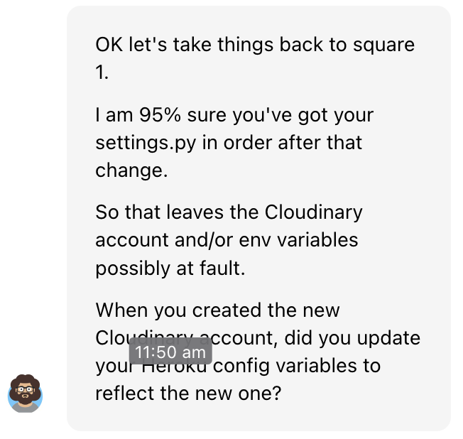 | Ed explained after examining my code, that he is very sure that the code was not at fault and that it might be cloudinary or the env.y file. |
| 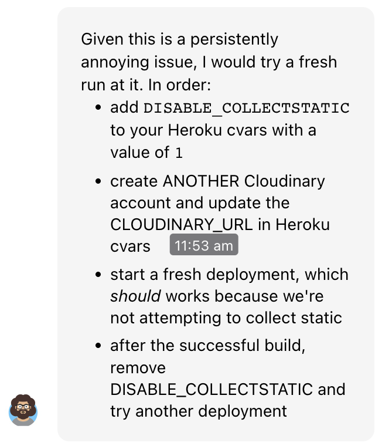 | Because Ed suspected cloudinary and/env.py was at fault, he suggested the follwing solution. I did exatly as he told me in order. I added the DISABLE_COLLECTSTATS back into the cvars, created a new account with a different email as the second time I had to re-create an account, copied the CLOUDINARY_URL to ensure no spelling errors, and pasted that into the heroku cvars. After that a re-deployed, to which it was a successful build because the DISABLE_COLLECTSTATS was still in the cvars, so i removed the DISABLE_COLLECTSTATS from the cvars. Still got the etag error.  |
| 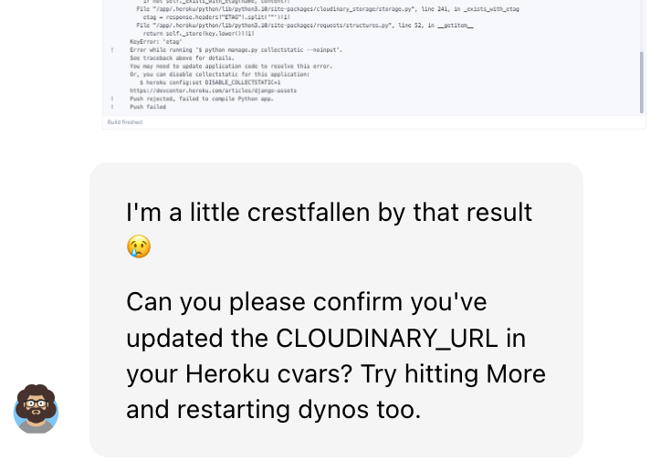 | Ed was crestfallen by the result, as was I. He asked if I'm sure that I added the URL to the cvars, to which I send him a screenshot of the cloudinary url as I was ensured by Ed that there was not securety risk, we jus twanted to find a solution to this build error. He confirmed that the CLOUDINARY_URL's are the same on cludinary and cvars.  |
|  | Ed asked if I could log into my heroku account via the terminal on my code so he could do some testing and see if he could find any extra information on the issue. He also helped me on how to log into Herkou via termin as I had MFA enabled. |
|  | Ed apologised for the fact that I'm going through this annoying build failure, and said that he would need to ask a wider team fir suggestions. |
|  | Ed apologised for the fact that I'm going through this annoying build failure, and said that he would need to ask a wider team fir suggestions. |

## Table of Contents

1. [Testing User Stories](#testing-user-stories)
2. [Code Validation](#code-validation)
3. [Accessibility](#accessibility)
4. [Tools Testing](#tools-testing)
5. [Manual Testing](#manual-testing)

***

## Testing User Stories
### 1. As a site admin I can create, update and Delete campaigns and venues.
* An admin site has been provided so that the Site Admin can manage campaigns and venues.
* Campaigns and venues can be created updated and deleted from the site
* Campaigns and Venues fields are displayed for the Site Admin to identify them easily
***
### 2. As a Site User I can register an account so that I can create campaigns and book Venues
* Account registration has been provided for Site User
* Registered Site Users are given the possibility to create campaigns and book venues.
* Registered Site Users are able to edit and delete their own campaigns and venues they booked.
***
### 3. As a Site User I can create multiple campaigns.
* Create a campaign page are provided for Site Users.
* A form is available inside that page to allow the user to create a new campaign.
***
### 4. As a Site User I can edit and delete my own campaigns so I can manage the campaigns I created
* Edit and Delete Campaign pages are provided for registered Site User
* A form is available inside those pages for the Site Users to be able to edit or delete a specific campaign
* The Edit Campaign form is pre-populated with the current data for the user to be able to edit the content.
* A Delete Campaign form is provided for Site Users to confirm the deletion
* Edit and Delete button are displayed on the campaigns the user has created to access the respective page
***
### 5. As a Site Users I can view all the available venues at each region
* A clickable image is available to for the Site User to select a region.
* Information will show depending on the region the Site User clicks on
***

## Code Validation

### HTML

The [W3C Markup Validator](https://validator.w3.org/) service was used to validate the HTML code of the project in order to ensure there were no syntax errors.
 
W3C Markup Validator found the following errors concerning index.html.

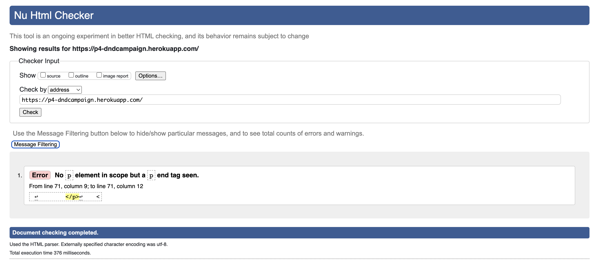

The errors could not be resolved because on the validator it shows that there is a closing tag with no opening tag, but that is not the case. As seen in image below.

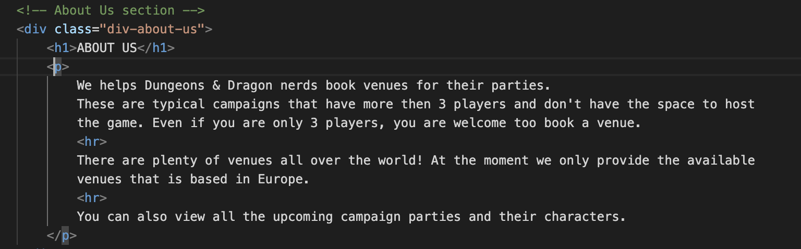
***
### CSS

[W3C CSS Validator](https://jigsaw.w3.org/css-validator/) service was used to validate the CSS code of the project in order to ensure there were no syntax errors. 

Because My static file aren't showing with Cloudinary, I had to copy and paste the text into the validator with direct Input.
There was not errors.

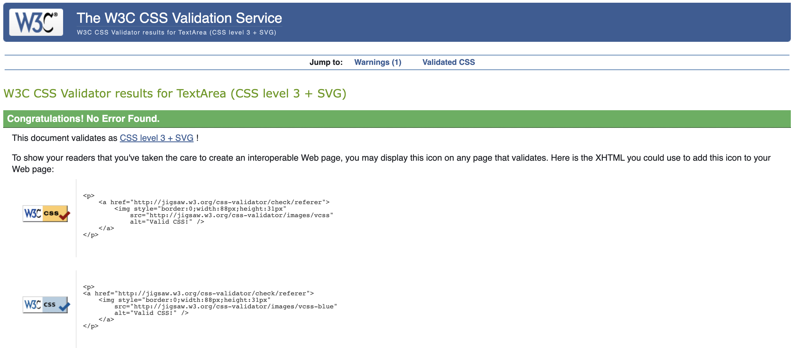
***
### Pyhton

Pylint was used continuously during the development process to analyze the Python code for programming errors.

[Python Checker](https://www.pythonchecker.com/) was further used to validate the Python code to validate the Python code for PEP8 requirements. See below the validation results and the reviewed results. Unfortunalty because the Original PEP8 Online doesn't work anymore, the warnings on this python checker website, does not use the django python formatting. So most of the warning suggest useing spaces where it is not to be used in the code. (Can be seen in images below) 

| Location | Errors / Warnings | Code Reviewed |
| --- | --- | --- |
| ./booker/admin.py | No errors / warnings | 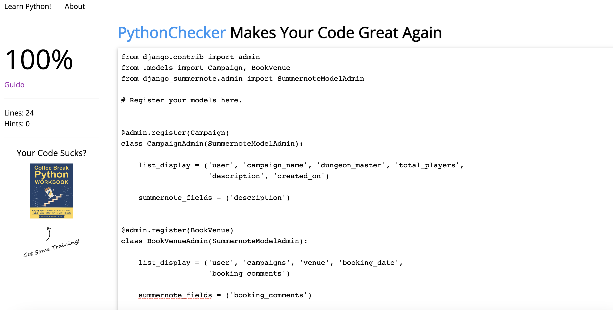 |
| ./booker/forms.py | 24 'warnings' | 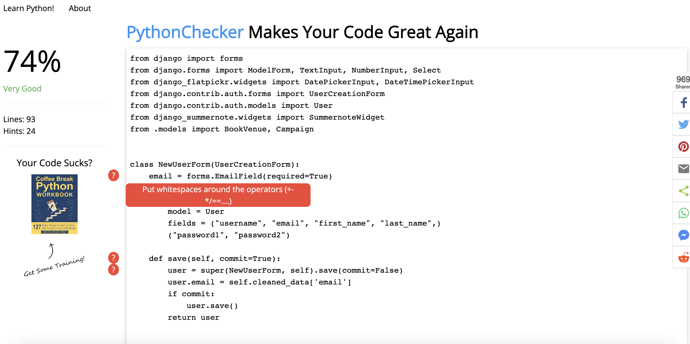 |
| ./booker/models.py | 28 'warnings' |  |
| ./booker/views.py | No errors / warnings | 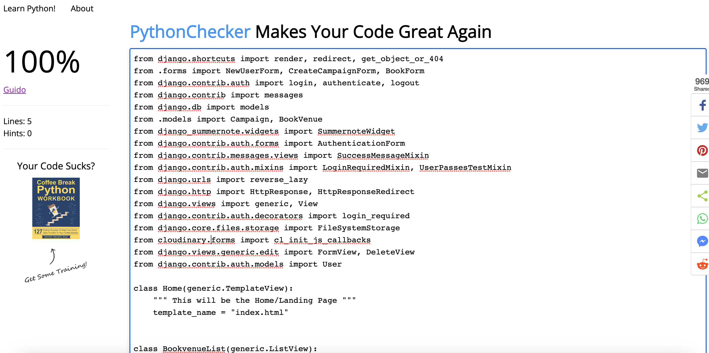 |

***
### JavaScript

[JSHints JavaScript Code Quality Tool](https://jshint.com/) was used to validate the site's JavaScript code. 

No errors were found.
***

## Accessibility

Lighthouse in Chrome DevTools has been used to confirm that the colors and fonts being used throughout the website are easy to read and accessible. 
Testing was done on Local run as the heroku deployed build failed.
See reports in the table below:

### Lighthouse Reports

Page | Lighthouse Report |
| --- | --- |
| Landing Page | 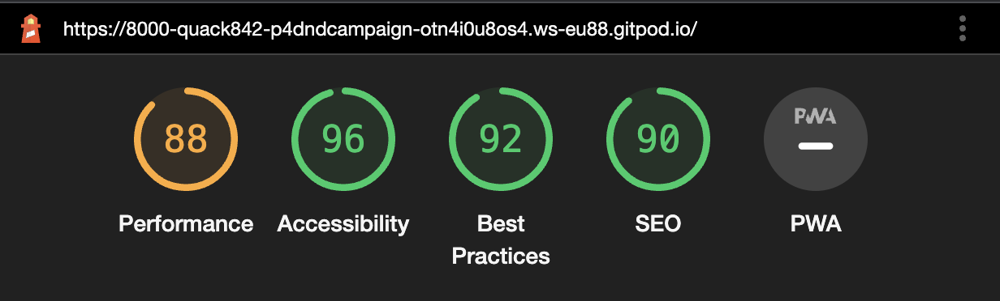 |
| Upcoming Campaigns | 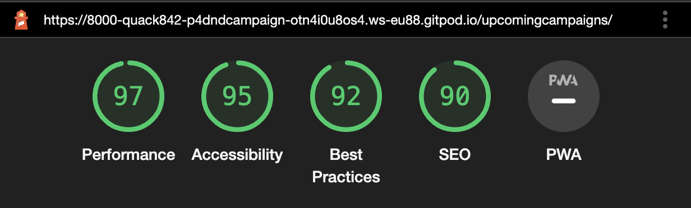 |
| Venues Page | 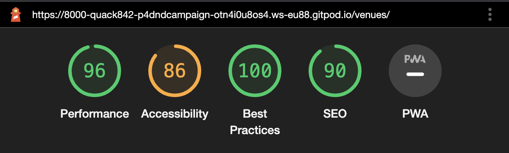 |
| Create Campaign Page | 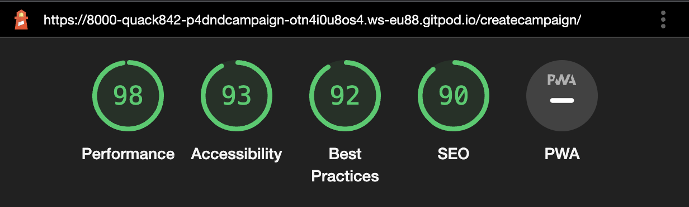 |
| Profile Page | 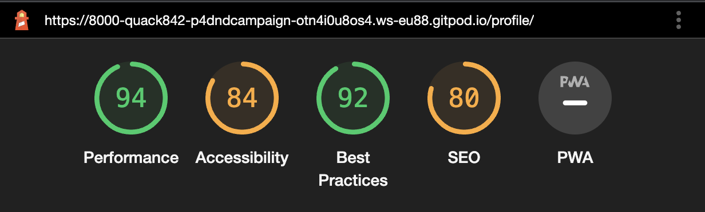 |
| Dashboard Page |  |

## Tools Testing

### [Chrome DevTools](https://developer.chrome.com/docs/devtools/)

Chrome DevTools was used during the development process to test, explore and modify HTML elements and CSS style used in the project.

### Responsiveness

* [Am I Responsive?](http://ami.responsivedesign.is/#) was used to check responsiveness of the site pages across different devices.

* Chrome DevTools was used to test responsiveness in different screen sizes during the development process.

## Manual Testing

### Browser Compatibility

Browser | Outcome | Pass/Fail | 
--- | --- | --- |
Google Chrome | No appearance, responsiveness nor functionality issues.| Pass |
Safari | No appearance, responsiveness nor functionality issues. | Pass |
Mozilla Firefox | No responsiveness nor functionality issues.| Pass |
Microsoft Edge | No appearance, responsiveness nor functionality issues. | Pass |

### Device Compatibility

Device | Operative System |Outcome | Pass/Fail
--- | --- | --- | --- |
Dell Optiplex 7060 | Windows 11 | No appearance, responsiveness nor functionality issues. | Pass |
MacBook Pro 15" | macOS Big Sur | No appearance, responsiveness nor functionality issues. | Pass |
Dell Latitude 5300 | Windows 10 | No appearance, responsiveness nor functionality issues. | Pass |
iPad Pro 12.9" | iOS 15 | No appearance, responsiveness nor functionality issues. | Pass |
iPad Pro 10.5" | iOS 15 |No appearance, responsiveness nor functionality issues. | Pass |
iPhone XR | iOS 15 |No appearance, responsiveness nor functionality issues. | Pass |
iPhone 7 | iOS 15 |No appearance, responsiveness nor functionality issues. | Pass |

### Test Results

#### General

<table>
    <tr>
        <th colspan=2>Feature</th>
        <th>Users</th>
        <th>Test</th>
        <th>Outcome</th>
        <th>Pass/Fail</th>
    </tr>
    <tr>
        <td rowspan=14>Navigation Bar</td>
        <td rowspan=2>Main logo link</td>
        <td rowspan=2>All</td>
        <td>Functionality</td>
        <td>Clicking the link redirects to the Home page.</td>
        <td>Pass</td>
    </tr>
    <tr>
        <td>Style</td>
        <td>N/A</td>
        <td>N/A</td>
    </tr>
    <tr>
        <td rowspan=2>Home link</td>
        <td rowspan=2>All</td>
        <td>Functionality</td>
        <td>Clicking the link redirects to the Home page.</td>
        <td>Pass</td>
    </tr>
    <tr>
        <td>Style</td>
        <td>Hover effect working as expected.</td>
        <td>Pass</td>
    </tr>
    <tr>
        <td rowspan=2>About link</td>
        <td rowspan=2>All</td>
        <td>Functionality</td>
        <td>Clicking the link redirects to the About page.</td>
        <td>Pass</td>
    </tr>
    <tr>
        <td>Style</td>
        <td>Hover effect working as expected.</td>
        <td>Pass</td>
    </tr>
    <tr>
        <td rowspan=2>Register link</td>
        <td rowspan=2>Unregistered</td>
        <td>Functionality</td>
        <td>Clicking the link redirects to the Register page.</td>
        <td>Pass</td>
    </tr>
    <tr>
        <td>Style</td>
        <td>Hover effect working as expected.</td>
        <td>Pass</td>
    </tr>
    <tr>
        <td rowspan=2>Login link</td>
        <td rowspan=2>Unregistered</td>
        <td>Functionality</td>
        <td>Clicking the link redirects to the Login page.</td>
        <td>Pass</td>
    </tr>
    <tr>
        <td>Style</td>
        <td>Hover effect working as expected.</td>
        <td>Pass</td>
    </tr>
    <tr>
        <td rowspan=2>Logout link</td>
        <td rowspan=2>Registered</td>
        <td>Functionality</td>
        <td>Clicking the link redirects to the Logout page.</td>
        <td>Pass</td>
    </tr>
    <tr>
        <td>Style</td>
        <td>Hover effect working as expected.</td>
        <td>Pass</td>
    </tr>
    <tr>
        <td rowspan=2>Hamburger Menu button </td>
        <td rowspan=2>All</td>
        <td>Functionality</td>
        <td>Clicking the button toggle navigation menu.</td>
        <td>Pass</td>
    </tr>
    <tr>
        <td>Style</td>
        <td>Responsive navigation menu on smaller screens. Hover effect working as expected.</td>
        <td>Pass</td>
    </tr>
    <tr>
        <td rowspan=4>Search Bar</td>
        <td rowspan=2>Input field</td>
        <td rowspan=2>All</td>
        <td>Functionality</td>
        <td>Placeholder "Search Question" shows as expected. Text can be entered in the field.</td>
        <td>Pass</td>
    </tr>
    <tr>
        <td>Style</td>
        <td>Focus effect working as expected.</td>
        <td>Pass</td>
    </tr>
    <tr>
        <td rowspan=2>Search button</td>
        <td rowspan=2>All</td>
        <td>Functionality</td>
        <td>Clicking the link redirects to the Search Results page. Input text is being posted to the Search Results page correctly.</td>
        <td>Pass</td>
    </tr>
    <tr>
        <td>Style</td>
        <td>Hover effect working as expected.</td>
        <td>Pass</td>
    </tr>
    <tr>
        <td rowspan=10>Footer</td>
        <td rowspan=2>Logo link</td>
        <td rowspan=2>All</td>
        <td>Functionality</td>
        <td>Clicking the link redirects to the home page.</td>
        <td>Pass</td>
    </tr>
    <tr>
        <td>Style</td>
        <td>Hover effect working as expected.</td>
        <td>Pass</td>
    </tr>
    <tr>
        <td rowspan=2>Facebook icon</td>
        <td rowspan=2>All</td>
        <td>Functionality</td>
        <td>Clicking the link open Facebook page on a separate tab.</td>
        <td>Pass</td>
    </tr>
    <tr>
        <td>Style</td>
        <td>Hover effect working as expected.</td>
        <td>Pass</td>
    </tr>
    <tr>
        <td rowspan=2>Instagram icon</td>
        <td rowspan=2>All</td>
        <td>Functionality</td>
        <td>Clicking the link open Instagram page on a separate tab.</td>
        <td>Pass</td>
    </tr>
    <tr>
        <td>Style</td>
        <td>Hover effect working as expected.</td>
        <td>Pass</td>
    </tr>
    <tr>
        <td rowspan=2>Youtube icon</td>
        <td rowspan=2>All</td>
        <td>Functionality</td>
        <td>Clicking the link open Youtube page on a separate tab.</td>
        <td>Pass</td>
    </tr>
    <tr>
        <td>Style</td>
        <td>Hover effect working as expected.</td>
        <td>Pass</td>
    </tr>
    <tr>
        <td rowspan=2>Twitter icon</td>
        <td rowspan=2>All</td>
        <td>Functionality</td>
        <td>Clicking the link open Twitter page on a separate tab.</td>
        <td>Pass</td>
    </tr>
    <tr>
        <td>Style</td>
        <td>Hover effect working as expected.</td>
        <td>Pass</td>
    </tr>
</table>

#### Home Page 

<table>
    <tr>
        <th colspan=2>Feature</th>
        <th>Users</th>
        <th>Test</th>
        <th>Outcome</th>
        <th>Pass/Fail</th>
    </tr>
    <tr>
        <td rowspan=2>Page Buttons</td>
        <td rowspan=2>Ask Question button</td>
        <td rowspan=2>All</td>
        <td>Functionality</td>
        <td>Clicking the button redirects to the Ask Question page.</td>
        <td>Pass</td>
    </tr>
    <tr>
        <td>Style</td>
        <td>Hover effect working as expected.</td>
        <td>Pass</td>
    </tr>
    <tr>
        <td rowspan=12>Question</td>
        <td rowspan=2>Score</td>
        <td rowspan=2>All</td>
        <td>Functionality</td>
        <td>Score renders correctly.</td>
        <td>Pass</td>
    </tr>
    <tr>
        <td>Style</td>
        <td>N/A</td>
        <td>N/A</td>
    </tr>
    <tr>
        <td rowspan=2>Title link</td>
        <td rowspan=2>All</td>
        <td>Functionality</td>
        <td>Title renders correctly. Clicking the link redirects to Question Detail page for the correct question.</td>
        <td>Pass</td>
    </tr>
    <tr>
        <td>Style</td>
        <td>Hover effect working as expected.</td>
        <td>Pass</td>
    </tr>
    <tr>
        <td rowspan=2>Author</td>
        <td rowspan=2>All</td>
        <td>Functionality</td>
        <td>Author renders correctly.</td>
        <td>Pass</td>
    </tr>
    <tr>
        <td>Style</td>
        <td>N/A</td>
        <td>N/A</td>
    </tr>
    <tr>
        <td rowspan=2>Last updated</td>
        <td rowspan=2>All</td>
        <td>Functionality</td>
        <td>Date and time when the question was created display correctly.</td>
        <td>Pass</td>
    </tr>
    <tr>
        <td>Style</td>
        <td>N/A</td>
        <td>N/A</td>
    </tr>
    <tr>
        <td rowspan=2>Edit Question button</td>
        <td rowspan=2>Registered</td>
        <td>Functionality</td>
        <td>Clicking the button redirects to Edit Question page for the correct question.</td>
        <td>Pass</td>
    </tr>
    <tr>
        <td>Style</td>
        <td>Hover effect working as expected.</td>
        <td>Pass</td>
    </tr>
    <tr>
        <td rowspan=2>Delete Question button</td>
        <td rowspan=2>Registered</td>
        <td>Functionality</td>
        <td>Clicking the button redirects to Delete Question page for the correct question.</td>
        <td>Pass</td>
    </tr>
    <tr>
        <td>Style</td>
        <td>Hover effect working as expected.</td>
        <td>Pass</td>
    </tr>
    <tr>
        <td rowspan=4>Voting</td>
        <td rowspan=2>Upvote button</td>
        <td rowspan=2>Registered</td>
        <td>Functionality</td>
        <td>Clicking the button toggle the user's upvote. Score is updated by 1.</td>
        <td>Pass</td>
    </tr>
    <tr>
        <td>Style</td>
        <td>Hover effect working as expected. Button selection is not working correctly. Button stay selected/unselected for all users and not only for the current user.</td>
        <td>Fail</td>
    </tr>
    <tr>
        <td rowspan=2>Downvote button</td>
        <td rowspan=2>Registered</td>
        <td>Functionality</td>
        <td>Clicking the button toggle the user's upvote. Score is updated by -1.</td>
        <td>Pass</td>
    </tr>
    <tr>
        <td>Style</td>
        <td>Hover effect working as expected. Button selection is not working correctly. Button stay selected/unselected for all users and not only for the current user.</td>
        <td>Fail</td>
    </tr>
    <tr>
        <td rowspan=4>Site Pagination</td>
        <td rowspan=2>Pagination</td>
        <td rowspan=2>All</td>
        <td>Functionality</td>
        <td>Pagination occurs if more than 10 questions are listed.</td>
        <td>Pass</td>
    </tr>
    <tr>
        <td>Style</td>
        <td>N/A</td>
        <td>N/A</td>
    </tr>
    <tr>
        <td rowspan=2>Pagination Buttons</td>
        <td rowspan=2>All</td>
        <td>Functionality</td>
        <td>Clicking the buttons navigate back and forth between the pages.</td>
        <td>Pass</td>
    </tr>
    <tr>
        <td>Style</td>
        <td>Hover effect working as expected.</td>
        <td>Pass</td>
    </tr>
</table>

#### About Page 

<table>
    <tr>
        <th>Feature</th>
        <th>Users</th>
        <th>Test</th>
        <th>Outcome</th>
        <th>Pass/Fail</th>
    </tr>
    <tr>
        <td rowspan=2>General</td>
        <td rowspan=2>All</td>
        <td>Functionality</td>
        <td>About page render correctly</td>
        <td>Pass</td>
    </tr>
    <tr>
        <td>Style</td>
        <td>General styling</td>
        <td>Pass</td>
    </tr>
</table>

#### Search Results Page

<table>
    <tr>
        <th colspan=2>Feature</th>
        <th>Users</th>
        <th>Test</th>
        <th>Outcome</th>
        <th>Pass/Fail</th>
    </tr>
    <tr>
        <td rowspan=2>General</td>
        <td rowspan=2>Main Title</td>
        <td rowspan=2>All</td>
        <td>Functionality</td>
        <td>Title display correct information depending on the results.</td>
        <td>Pass</td>
    </tr>
    <tr>
        <td>Style</td>
        <td>N/A</td>
        <td>N/A</td>
    </tr>
    <tr>
        <td rowspan=12>Question</td>
        <td rowspan=2>Score</td>
        <td rowspan=2>All</td>
        <td>Functionality</td>
        <td>Score renders correctly.</td>
        <td>Pass</td>
    </tr>
    <tr>
        <td>Style</td>
        <td>N/A</td>
        <td>N/A</td>
    </tr>
    <tr>
        <td rowspan=2>Title link</td>
        <td rowspan=2>All</td>
        <td>Functionality</td>
        <td>Title renders correctly. Clicking the link redirects to Question Detail page for the correct question.</td>
        <td>Pass</td>
    </tr>
    <tr>
        <td>Style</td>
        <td>Hover effect working as expected.</td>
        <td>Pass</td>
    </tr>
    <tr>
        <td rowspan=2>Author</td>
        <td rowspan=2>All</td>
        <td>Functionality</td>
        <td>Author renders correctly.</td>
        <td>Pass</td>
    </tr>
    <tr>
        <td>Style</td>
        <td>N/A</td>
        <td>N/A</td>
    </tr>
    <tr>
        <td rowspan=2>Last updated</td>
        <td rowspan=2>All</td>
        <td>Functionality</td>
        <td>Date and time when the question was created display correctly.</td>
        <td>Pass</td>
    </tr>
    <tr>
        <td>Style</td>
        <td>N/A</td>
        <td>N/A</td>
    </tr>
    <tr>
        <td rowspan=2>Edit Question button</td>
        <td rowspan=2>Registered</td>
        <td>Functionality</td>
        <td>Clicking the button redirects to Edit Question page for the correct question.</td>
        <td>Pass</td>
    </tr>
    <tr>
        <td>Style</td>
        <td>Hover effect working as expected.</td>
        <td>Pass</td>
    </tr>
    <tr>
        <td rowspan=2>Delete Question button</td>
        <td rowspan=2>Registered</td>
        <td>Functionality</td>
        <td>Clicking the button redirects to Delete Question page for the correct question.</td>
        <td>Pass</td>
    </tr>
    <tr>
        <td>Style</td>
        <td>Hover effect working as expected.</td>
        <td>Pass</td>
    </tr>
    <tr>
        <td rowspan=4>Site Pagination</td>
        <td rowspan=2>Pagination</td>
        <td rowspan=2>All</td>
        <td>Functionality</td>
        <td>Pagination is not occurring if more than 10 questions are listed.</td>
        <td>Fail</td>
    </tr>
    <tr>
        <td>Style</td>
        <td>N/A</td>
        <td>N/A</td>
    </tr>
    <tr>
        <td rowspan=2>Pagination Buttons</td>
        <td rowspan=2>All</td>
        <td>Functionality</td>
        <td>N/A</td>
        <td>N/A</td>
    </tr>
    <tr>
        <td>Style</td>
        <td>N/A</td>
        <td>N/A</td>
    </tr>
</table>

#### Question Detail Page

<table>
    <tr>
        <th colspan=2>Feature</th>
        <th>Users</th>
        <th>Test</th>
        <th>Outcome</th>
        <th>Pass/Fail</th>
    </tr>
    <tr>
        <td rowspan=2>Page Buttons</td>
        <td rowspan=2>Reply Question button</td>
        <td rowspan=2>All</td>
        <td>Functionality</td>
        <td>Clicking the button redirects to the Reply Question page.</td>
        <td>Pass</td>
    </tr>
    <tr>
        <td>Style</td>
        <td>Hover effect working as expected.</td>
        <td>Pass</td>
    </tr>
    <tr>
        <td rowspan=14>Question</td>
        <td rowspan=2>Score</td>
        <td rowspan=2>All</td>
        <td>Functionality</td>
        <td>Score renders correctly.</td>
        <td>Pass</td>
    </tr>
    <tr>
        <td>Style</td>
        <td>N/A</td>
        <td>N/A</td>
    </tr>
    <tr>
        <td rowspan=2>Title</td>
        <td rowspan=2>All</td>
        <td>Functionality</td>
        <td>Title renders correctly.</td>
        <td>Pass</td>
    </tr>
    <tr>
        <td>Style</td>
        <td>N/A</td>
        <td>N/A</td>
    </tr>
    <tr>
        <td rowspan=2>Author</td>
        <td rowspan=2>All</td>
        <td>Functionality</td>
        <td>Author renders correctly.</td>
        <td>Pass</td>
    </tr>
    <tr>
        <td>Style</td>
        <td>N/A</td>
        <td>N/A</td>
    </tr>
    <tr>
        <td rowspan=2>Content</td>
        <td rowspan=2>All</td>
        <td>Functionality</td>
        <td>Content renders correctly.</td>
        <td>Pass</td>
    </tr>
    <tr>
        <td>Style</td>
        <td>N/A</td>
        <td>N/A</td>
    </tr>
    <tr>
        <td rowspan=2>Last updated</td>
        <td rowspan=2>All</td>
        <td>Functionality</td>
        <td>Date and time when the question was created display correctly.</td>
        <td>Pass</td>
    </tr>
    <tr>
        <td>Style</td>
        <td>N/A</td>
        <td>N/A</td>
    </tr>
    <tr>
        <td rowspan=2>Edit Question button</td>
        <td rowspan=2>Registered</td>
        <td>Functionality</td>
        <td>Clicking the button redirects to Edit Question page for the correct question.</td>
        <td>Pass</td>
    </tr>
    <tr>
        <td>Style</td>
        <td>Hover effect working as expected.</td>
        <td>Pass</td>
    </tr>
    <tr>
        <td rowspan=2>Delete Question button</td>
        <td rowspan=2>Registered</td>
        <td>Functionality</td>
        <td>Clicking the button redirects to Delete Question page for the correct question.</td>
        <td>Pass</td>
    </tr>
    <tr>
        <td>Style</td>
        <td>Hover effect working as expected.</td>
        <td>Pass</td>
    </tr>
        <tr>
        <td rowspan=12>Reply</td>
        <td rowspan=2>Score</td>
        <td rowspan=2>All</td>
        <td>Functionality</td>
        <td>Score renders correctly.</td>
        <td>Pass</td>
    </tr>
    <tr>
        <td>Style</td>
        <td>N/A</td>
        <td>N/A</td>
    </tr>
    <tr>
        <td rowspan=2>Body</td>
        <td rowspan=2>All</td>
        <td>Functionality</td>
        <td>Body renders correctly.</td>
        <td>Pass</td>
    </tr>
    <tr>
        <td>Style</td>
        <td>N/A</td>
        <td>N/A</td>
    </tr>
    <tr>
        <td rowspan=2>Author</td>
        <td rowspan=2>All</td>
        <td>Functionality</td>
        <td>Author renders correctly.</td>
        <td>Pass</td>
    </tr>
    <tr>
        <td>Style</td>
        <td>N/A</td>
        <td>N/A</td>
    </tr>
    <tr>
        <td rowspan=2>Last updated</td>
        <td rowspan=2>All</td>
        <td>Functionality</td>
        <td>Date and time when the question was created display correctly.</td>
        <td>Pass</td>
    </tr>
    <tr>
        <td>Style</td>
        <td>N/A</td>
        <td>N/A</td>
    </tr>
    <tr>
        <td rowspan=2>Edit Reply button</td>
        <td rowspan=2>Registered</td>
        <td>Functionality</td>
        <td>Clicking the button redirects to Edit Reply page for the correct reply.</td>
        <td>Pass</td>
    </tr>
    <tr>
        <td>Style</td>
        <td>Hover effect working as expected.</td>
        <td>Pass</td>
    </tr>
    <tr>
        <td rowspan=2>Delete Reply button</td>
        <td rowspan=2>Registered</td>
        <td>Functionality</td>
        <td>Clicking the button redirects to Delete Reply page for the correct reply.</td>
        <td>Pass</td>
    </tr>
    <tr>
        <td>Style</td>
        <td>Hover effect working as expected.</td>
        <td>Pass</td>
    </tr>
    <tr>
        <td rowspan=8>Voting</td>
        <td rowspan=2>Queston Upvote button</td>
        <td rowspan=2>Registered</td>
        <td>Functionality</td>
        <td>Clicking the button toggle the user's upvote. Score is updated by 1.</td>
        <td>Pass</td>
    </tr>
    <tr>
        <td>Style</td>
        <td>Hover effect working as expected. Button selection is not working correctly. Button stay selected/unselected for all users and not only for the current user.</td>
        <td>Fail</td>
    </tr>
    <tr>
        <td rowspan=2>Question Downvote button</td>
        <td rowspan=2>Registered</td>
        <td>Functionality</td>
        <td>Clicking the button toggle the user's upvote. Score is updated by -1.</td>
        <td>Pass</td>
    </tr>
    <tr>
        <td>Style</td>
        <td>Hover effect working as expected. Button selection is not working correctly. Button stay selected/unselected for all users and not only for the current user.</td>
        <td>Fail</td>
    </tr>
    <tr>
        <td rowspan=2>Reply Upvote button</td>
        <td rowspan=2>Registered</td>
        <td>Functionality</td>
        <td>Clicking the button toggle the user's upvote. Score is updated by 1.</td>
        <td>Pass</td>
    </tr>
    <tr>
        <td>Style</td>
        <td>Hover effect working as expected. Button selection is not working correctly. Button stay selected/unselected for all users and not only for the current user.</td>
        <td>Fail</td>
    </tr>
    <tr>
        <td rowspan=2>Reply Downvote button</td>
        <td rowspan=2>Registered</td>
        <td>Functionality</td>
        <td>Clicking the button toggle the user's upvote. Score is updated by -1.</td>
        <td>Pass</td>
    </tr>
    <tr>
        <td>Style</td>
        <td>Hover effect working as expected. Button selection is not working correctly. Button stay selected/unselected for all users and not only for the current user.</td>
        <td>Fail</td>
    </tr>
</table>

#### Ask Question Page

<table>
    <tr>
        <th colspan=2>Feature</th>
        <th>Users</th>
        <th>Test</th>
        <th>Outcome</th>
        <th>Pass/Fail</th>
    </tr>
    <tr>
        <td rowspan=8>Question Form</td>
        <td rowspan=2>Title input</td>
        <td rowspan=2>Registered</td>
        <td>Functionality</td>
        <td>Text can be entered in the field. Validation occurs if field is left empty</td>
        <td>Pass</td>
    </tr>
    <tr>
        <td>Style</td>
        <td>Focus effect working as expected.</td>
        <td>Pass</td>
    </tr>
    <tr>
        <td rowspan=2>Content input</td>
        <td rowspan=2>Registered</td>
        <td>Functionality</td>
        <td>Summernote editor display correctly. Text can be entered in the field. Unable to validate when field is left empty. Unable to submit if this happens as form is invalid.</td>
        <td>Fail</td>
    </tr>
    <tr>
        <td>Style</td>
        <td>Styled correctly by Summernote CSS code.</td>
        <td>Pass</td>
    </tr>
    <tr>
        <td rowspan=2>Submit button</td>
        <td rowspan=2>Registered</td>
        <td>Functionality</td>
        <td>Clicking the button submit the form and redirects to the Home page. Submit question if valid. Display message if the form submits successfully or not.</td>
        <td>Pass</td>
    </tr>
    <tr>
        <td>Style</td>
        <td>Hover effect working as expected.</td>
        <td>Pass</td>
    </tr>
    <tr>
        <td rowspan=2>Cancel button</td>
        <td rowspan=2>Registered</td>
        <td>Functionality</td>
        <td>Clicking the button redirects to the Home page.</td>
        <td>Pass</td>
    </tr>
    <tr>
        <td>Style</td>
        <td>Hover effect working as expected.</td>
        <td>Pass</td>
    </tr>
</table>

#### Leave Reply Page

<table>
    <tr>
        <th colspan=2>Feature</th>
        <th>Users</th>
        <th>Test</th>
        <th>Outcome</th>
        <th>Pass/Fail</th>
    </tr>
    <tr>
        <td rowspan=6>Reply Form</td>
        <td rowspan=2>Body input</td>
        <td rowspan=2>Registered</td>
        <td>Functionality</td>
        <td>Summernote editor display correctly. Text can be entered in the field. Unable to validate when field is left empty. Unable to submit if this happens as form is invalid.</td>
        <td>Fail</td>
    </tr>
    <tr>
        <td>Style</td>
        <td>Styled correctly by Summernote CSS code.</td>
        <td>Pass</td>
    </tr>
    <tr>
        <td rowspan=2>Submit button</td>
        <td rowspan=2>Registered</td>
        <td>Functionality</td>
        <td>Clicking the button submit the form and redirects to the originating page. Submit question if valid. Display message if the form submits successfully or not</td>
        <td>Pass</td>
    </tr>
    <tr>
        <td>Style</td>
        <td>Hover effect working as expected.</td>
        <td>Pass</td>
    </tr>
    <tr>
        <td rowspan=2>Cancel button</td>
        <td rowspan=2>Registered</td>
        <td>Functionality</td>
        <td>Clicking the button redirects to the Home page.</td>
        <td>Pass</td>
    </tr>
    <tr>
        <td>Style</td>
        <td>Hover effect working as expected.</td>
        <td>Pass</td>
    </tr>
</table>

#### Edit Question Page

<table>
    <tr>
        <th colspan=2>Feature</th>
        <th>Users</th>
        <th>Test</th>
        <th>Outcome</th>
        <th>Pass/Fail</th>
    </tr>
    <tr>
        <td rowspan=6>Question Form</td>
        <td rowspan=2>Title input</td>
        <td rowspan=2>All</td>
        <td>Functionality</td>
        <td> Text in the field is being prepopulated correctly. Text can be edited. Validation occurs if field is left empty</td>
        <td>Pass</td>
    </tr>
    <tr>
        <td>Style</td>
        <td>Focus effect working as expected.</td>
        <td>Pass</td>
    </tr>
    <tr>
        <td rowspan=2>Content input</td>
        <td rowspan=2>Registered</td>
        <td>Functionality</td>
        <td>Summernote editor display correctly. Text in the field is being prepopulated correctly. Text can be edited. Unable to validate when field is left empty. Unable to submit if this happens as form is invalid.</td>
        <td>Fail</td>
    </tr>
    <tr>
        <td>Style</td>
        <td>Styled correctly by Summernote CSS code.</td>
        <td>Pass</td>
    </tr>
    <tr>
        <td rowspan=2>Submit button</td>
        <td rowspan=2>Registered</td>
        <td>Functionality</td>
        <td>Clicking the button submit the form and redirects to the Home page. Edit question if form is valid. Display message if the question is edit successfully or not.</td>
        <td>Pass</td>
    </tr>
    <tr>
        <td>Style</td>
        <td>Hover effect working as expected.</td>
        <td>Pass</td>
    </tr>
</table>

#### Delete Question Page

<table>
    <tr>
        <th colspan=2>Feature</th>
        <th>Users</th>
        <th>Test</th>
        <th>Outcome</th>
        <th>Pass/Fail</th>
    </tr>
    <tr>
    <tr>
        <td rowspan=6>Delete Form</td>
        <td rowspan=2>Question Title</td>
        <td rowspan=2>Registered</td>
        <td>Functionality</td>
        <td>Question title renders correctly.</td>
        <td>Pass</td>
    </tr>
    <tr>
        <td>Style</td>
        <td>N/A</td>
        <td>N/A</td>
    </tr>
    <tr>
        <td rowspan=2>Yes button</td>
        <td rowspan=2>Registered</td>
        <td>Functionality</td>
        <td>Clicking the button submit the form and redirects to the Home page. Question get deleted. Display message if the question is deleted successfully or not.</td>
        <td>Pass</td>
    </tr>
    <tr>
        <td>Style</td>
        <td>Hover effect working as expected.</td>
        <td>Pass</td>
    </tr>
    <tr>
        <td rowspan=2>No button</td>
        <td rowspan=2>Registered</td>
        <td>Functionality</td>
        <td>Clicking the button redirects to the Home page without deleting the question.</td>
        <td>Pass</td>
    </tr>
    <tr>
        <td>Style</td>
        <td>Hover effect working as expected.</td>
        <td>Pass</td>
    </tr>
</table>

#### Edit Reply Page

<table>
    <tr>
        <th colspan=2>Feature</th>
        <th>Users</th>
        <th>Test</th>
        <th>Outcome</th>
        <th>Pass/Fail</th>
    </tr>
    <tr>
        <td rowspan=4>Reply Form</td>
        <td rowspan=2>Content input</td>
        <td rowspan=2>Registered</td>
        <td>Functionality</td>
        <td>Summernote editor display correctly. Text in the field is being prepopulated correctly. Text can be edited. Unable to validate when field is left empty. Unable to submit if this happens as form is invalid.</td>
        <td>Fail</td>
    </tr>
    <tr>
        <td>Style</td>
        <td>Styled correctly by Summernote CSS code.</td>
        <td>Pass</td>
    </tr>
    <tr>
        <td rowspan=2>Submit button</td>
        <td rowspan=2>Registered</td>
        <td>Functionality</td>
        <td>Clicking the button submit the form and redirects to the originating page. Edit question if form is valid. Display message if the reply is edit successfully or not.</td>
        <td>Pass</td>
    </tr>
    <tr>
        <td>Style</td>
        <td>Hover effect working as expected.</td>
        <td>Pass</td>
    </tr>
</table>

#### Delete Reply Page

<table>
    <tr>
        <th colspan=2>Feature</th>
        <th>Users</th>
        <th>Test</th>
        <th>Outcome</th>
        <th>Pass/Fail</th>
    </tr>
    <tr>
        <td rowspan=4>Delete Form</td>
        <td rowspan=2>Yes button</td>
        <td rowspan=2>Registered</td>
        <td>Functionality</td>
        <td>Clicking the button submit the form and redirects to the originating page. Reply gets deleted. Display message if the reply is deleted successfully or not.</td>
        <td>Pass</td>
    </tr>
    <tr>
        <td>Style</td>
        <td>Hover effect working as expected.</td>
        <td>Pass</td>
    </tr>
    <tr>
        <td rowspan=2>No button</td>
        <td rowspan=2>Registered</td>
        <td>Functionality</td>
        <td>Clicking the redirects to the originating page without deleting the reply.</td>
        <td>Pass</td>
    </tr>
    <tr>
        <td>Style</td>
        <td>Hover effect working as expected.</td>
        <td>Pass</td>
    </tr>
</table>

#### Sign Up Page

<table>
    <tr>
        <th colspan=2>Feature</th>
        <th>Users</th>
        <th>Test</th>
        <th>Outcome</th>
        <th>Pass/Fail</th>
    </tr>
    <tr>
        <td rowspan=10>Sign Up Form</td>
        <td rowspan=2>Username input</td>
        <td rowspan=2>All</td>
        <td>Functionality</td>
        <td>Text can be entered in the field. Field validates input to be present. Display message if the username already exists.</td>
        <td>Pass</td>
    </tr>
    <tr>
        <td>Style</td>
        <td>Focus effect working as expected.</td>
        <td>Pass</td>
    </tr>
    <tr>
        <td rowspan=2>E-mail input</td>
        <td rowspan=2>All</td>
        <td>Functionality</td>
        <td>Text can be entered in the field. Optional field. Allow to be left empty Validate input is an email address. Display message if the e-mail already exists.</td>
        <td>Pass</td>
    </tr>
    <tr>
        <td>Style</td>
        <td>Focus effect working as expected.</td>
        <td>Pass</td>
    </tr>
    <tr>
        <td rowspan=2>Password input</td>
        <td rowspan=2>All</td>
        <td>Functionality</td>
        <td>Text can be entered in the field. Field validates input to be present. Validate input is a valid password. Display message if password is not valid. Display message if both passwords are not equal.</td>
        <td>Pass</td>
    </tr>
    <tr>
        <td>Style</td>
        <td>Focus effect working as expected.</td>
        <td>Pass</td>
    </tr>
    <tr>
        <td rowspan=2>Password Repeat input</td>
        <td rowspan=2>All</td>
        <td>Functionality</td>
        <td>Text can be entered in the field. Field validates input to be present. Validate input is a valid password Display message if password is not valid Display message if both passwords are not equal</td>
        <td>Pass</td>
    </tr>
    <tr>
        <td>Style</td>
        <td>Focus effect working as expected.</td>
        <td>Pass</td>
    </tr>
    <tr>
        <td rowspan=2>Sign Up button</td>
        <td rowspan=2>All</td>
        <td>Functionality</td>
        <td>Clicking the button submit the form and redirects to the Home page. Create user if form is valid. Display message if user is successfully created.</td>
        <td>Pass</td>
    </tr>
    <tr>
        <td>Style</td>
        <td>Hover effect working as expected.</td>
        <td>Pass</td>
    </tr>
</table>

#### Login Page

<table>
    <tr>
        <th colspan=2>Feature</th>
        <th>Users</th>
        <th>Test</th>
        <th>Outcome</th>
        <th>Pass/Fail</th>
    </tr>
    <tr>
        <td rowspan=6>Sign In Form</td>
        <td rowspan=2>Username input</td>
        <td rowspan=2>All</td>
        <td>Functionality</td>
        <td>Text can be entered in the field. Field validates input to be present. Display message if the username doesn't exists.</td>
        <td>Pass</td>
    </tr>
    <tr>
        <td>Style</td>
        <td>Focus effect working as expected.</td>
        <td>Pass</td>
    </tr>
    <tr>
        <td rowspan=2>Password input</td>
        <td rowspan=2>All</td>
        <td>Functionality</td>
        <td>Text can be entered in the field. Field validates input to be present. Display message if password is not valid.</td>
        <td>Pass</td>
    </tr>
    <tr>
        <td>Style</td>
        <td>Focus effect working as expected.</td>
        <td>Pass</td>
    </tr>
    <tr>
        <td rowspan=2>Sign In button</td>
        <td rowspan=2>All</td>
        <td>Functionality</td>
        <td>Clicking the button authenticates the user and redirect to the Home page. Display message if credentials are not valid. Display message if user login successfully.</td>
        <td>Pass</td>
    </tr>
    <tr>
        <td>Style</td>
        <td>Hover effect working as expected.</td>
        <td>Pass</td>
    </tr>
</table>

#### Logout Page

<table>
    <tr>
        <th colspan=2>Feature</th>
        <th>Users</th>
        <th>Test</th>
        <th>Outcome</th>
        <th>Pass/Fail</th>
    </tr>
    <tr>
        <td rowspan=2>Sign Out Form</td>
        <td rowspan=2>Submit button</td>
        <td rowspan=2>All</td>
        <td>Functionality</td>
        <td>Clicking the button sign out the user and redirect to the Home page. Display message if user logout successfully.</td>
        <td>Pass</td>
    </tr>
    <tr>
        <td>Style</td>
        <td>Hover effect working as expected.</td>
        <td>Pass</td>
    </tr>
</table>