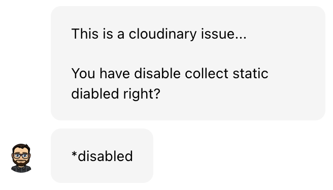
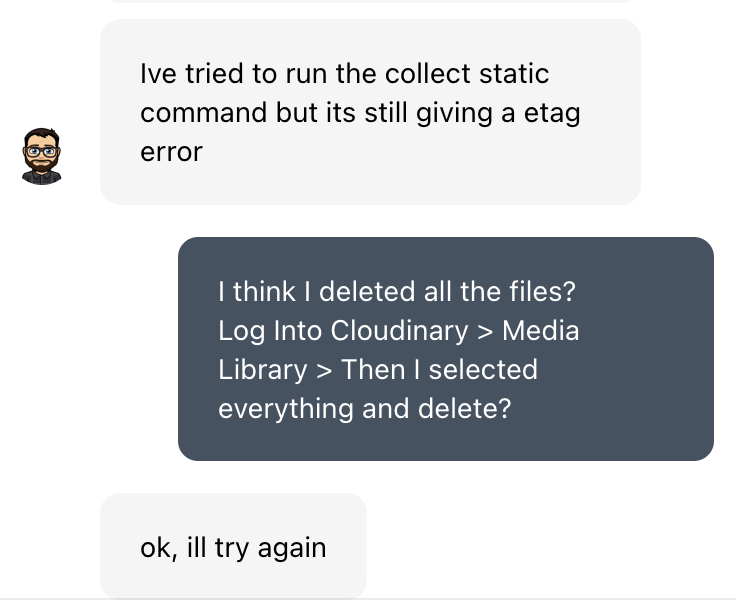
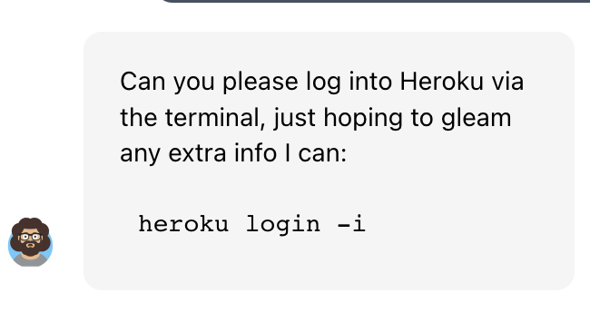
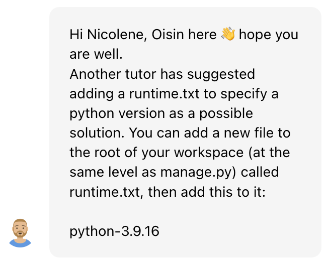
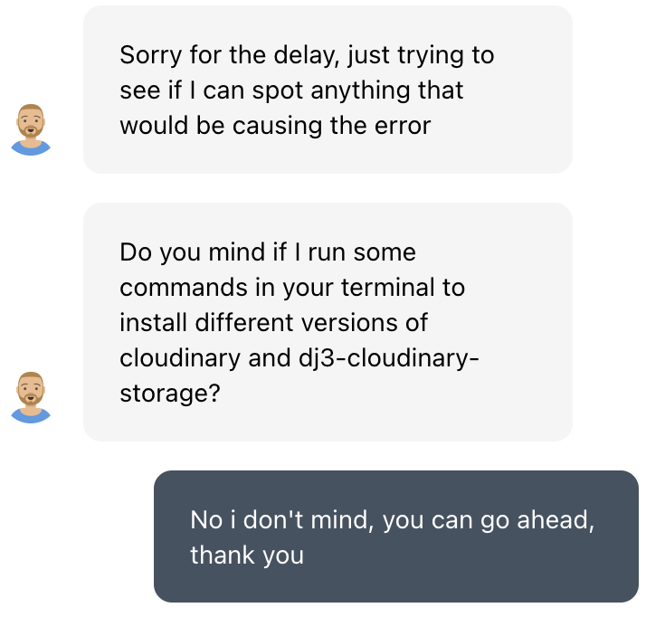
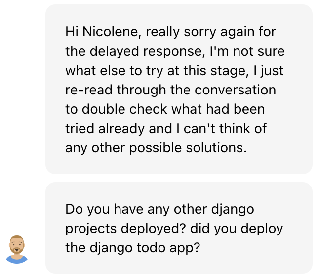
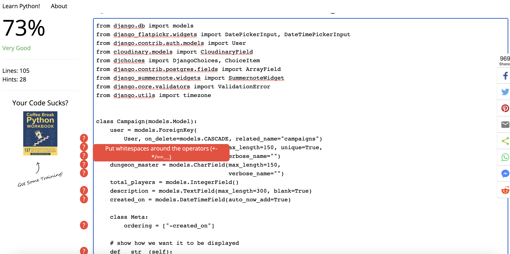
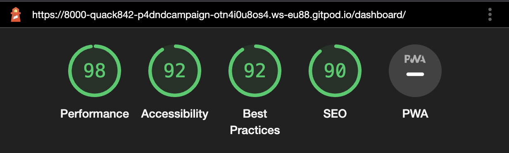
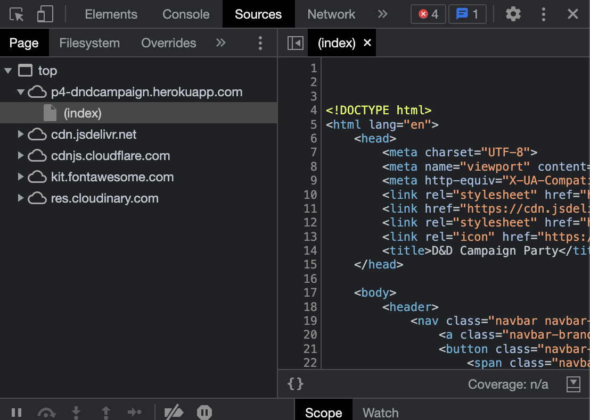

# D&D Dungeon Party Testing

[Back to the README.md file](https://github.com/Quack842/p4-dndcampaign#dd-dungeon-party)  

[Back to the Testing section in the README.md file](https://github.com/Quack842/p4-dndcampaign#testing)

[View the live website here]()

I am extremely greatful for the help and time these tutors spend spend on me to try and solve this, It is a shame we coulnd't end up solving the issue. 

When deplaying to Heroku, I kept getting a 'etag' KeyError.
The 4 different Tutors who tried to help me:
1. Sean
2. Ed
3. Oisin
4. Kevin

The follwong was done to try and resolve this build error:

| Tutor Suggestion | Steps tooked |
| --- | --- |
|  | I did exactly as told, deleted all the files on Cloudinary and re-build on Heroku, unfortunatly, It didn't work |
|  | Next Sean asked if the DISABLE_COLLECTSTATS in the cvars was deleted, and It already was. 
|  | Next Sean tried to run himself on my gitpod that I shared to allow him to help me, I ensure to him that I deleted the files by explaining how I did it and I sent him a screenshot if the Cloudinary with no files in. He got the same error. He sugested to try and deploy again, however, he could see himself that it failed again |
|  | Sean was very apologetic to say that the only other solution was to delete my cloudinary account and create a new key. I did as told and deleted my cloudinary account that was logged to my github account, and created a new account with a different email address. How ever, this still didn't fix the problem and errorKey |
|  | Next to struggle with me was Ed, he suggested that I add a ", " after the staic file. I did as told, as still 'etag' error |
|  | Ed asked if he could try something in the settings.py file and see if he could figure something out and help, but to no avail. |
|  | Ed explained after examining my code, that he is very sure that the code was not at fault and that it might be cloudinary or the env.y file. |
|  | Because Ed suspected cloudinary and/env.py was at fault, he suggested the follwing solution. I did exatly as he told me in order. I added the DISABLE_COLLECTSTATS back into the cvars, created a new account with a different email as the second time I had to re-create an account, copied the CLOUDINARY_URL to ensure no spelling errors, and pasted that into the heroku cvars. After that a re-deployed, to which it was a successful build because the DISABLE_COLLECTSTATS was still in the cvars, so i removed the DISABLE_COLLECTSTATS from the cvars. Still got the etag error.  |
|  | Ed was crestfallen by the result, as was I. He asked if I'm sure that I added the URL to the cvars, to which I send him a screenshot of the cloudinary url as I was ensured by Ed that there was not securety risk, we jus twanted to find a solution to this build error. He confirmed that the CLOUDINARY_URL's are the same on cludinary and cvars.  |
|  | Ed asked if I could log into my heroku account via the terminal on my code so he could do some testing and see if he could find any extra information on the issue. He also helped me on how to log into Herkou via termin as I had MFA enabled. |
|  | Ed apologised for the fact that I'm going through this annoying build failure, and said that he would need to ask a wider team fir suggestions. |
|  | Next tutor to attempt this monster was Oisin, he suggested that I should add a runtime.txt file with the python-3.9.16 inside this file. I did as instructed, added, commited, pushed, and re-deployed. Still got the same etag error. |
|  | Afterward, Oisin asked if he could try and add different Cloudinary file, to which I allowed him. I could see in the terminal that he tried adding different vesions of cloudinary, and still we ended up getting the same etag error when why try to run any collectstatic command. |
|  | Oisin also apologised for the fact that we are struggeling to find the solution, He asked if I had any other project that actually worked and runned. I did have one that worked. After this, Oisin also had to leave for his lunch break. |

## Table of Contents

1. [Testing User Stories](#testing-user-stories)
2. [Code Validation](#code-validation)
3. [Accessibility](#accessibility)
4. [Tools Testing](#tools-testing)
5. [Manual Testing](#manual-testing)

***

## Testing User Stories
### 1. As a site admin I can create, update and Delete campaigns and venues.
* An admin site has been provided so that the Site Admin can manage campaigns and venues.
* Campaigns and venues can be created updated and deleted from the site
* Campaigns and Venues fields are displayed for the Site Admin to identify them easily
***
### 2. As a Site User I can register an account so that I can create campaigns and book Venues
* Account registration has been provided for Site User
* Registered Site Users are given the possibility to create campaigns and book venues.
* Registered Site Users are able to edit and delete their own campaigns and venues they booked.
***
### 3. As a Site User I can create multiple campaigns.
* Create a campaign page are provided for Site Users.
* A form is available inside that page to allow the user to create a new campaign.
***
### 4. As a Site User I can edit and delete my own campaigns so I can manage the campaigns I created
* Edit and Delete Campaign pages are provided for registered Site User
* A form is available inside those pages for the Site Users to be able to edit or delete a specific campaign
* The Edit Campaign form is pre-populated with the current data for the user to be able to edit the content.
* A Delete Campaign form is provided for Site Users to confirm the deletion
* Edit and Delete button are displayed on the campaigns the user has created to access the respective page
***
### 5. As a Site Users I can view all the available venues at each region
* A clickable image is available to for the Site User to select a region.
* Information will show depending on the region the Site User clicks on
***

## Code Validation

### HTML

The [W3C Markup Validator](https://validator.w3.org/) service was used to validate the HTML code of the project in order to ensure there were no syntax errors.
 
W3C Markup Validator found the following errors concerning index.html.

The errors could not be resolved because on the validator it shows that there is a closing tag with no opening tag, but that is not the case. As seen in image below.

***
### CSS

[W3C CSS Validator](https://jigsaw.w3.org/css-validator/) service was used to validate the CSS code of the project in order to ensure there were no syntax errors. 

Because My static file aren't showing with Cloudinary, I had to copy and paste the text into the validator with direct Input.
There was not errors.

***
### Pyhton

Pylint was used continuously during the development process to analyze the Python code for programming errors.

[Python Checker](https://www.pythonchecker.com/) was further used to validate the Python code to validate the Python code for PEP8 requirements. See below the validation results and the reviewed results. Unfortunalty because the Original PEP8 Online doesn't work anymore, the warnings on this python checker website, does not use the django python formatting. So most of the warning suggest useing spaces where it is not to be used in the code. (Can be seen in images below) 

| Location | Errors / Warnings | Code Reviewed |
| --- | --- | --- |
| ./booker/admin.py | No errors / warnings |  |
| ./booker/forms.py | 24 'warnings' |  |
| ./booker/models.py | 28 'warnings' |  |
| ./booker/views.py | No errors / warnings |  |

***
### JavaScript

[JSHints JavaScript Code Quality Tool](https://jshint.com/) was used to validate the site's JavaScript code. 

No errors were found.
***

## Accessibility

Lighthouse in Chrome DevTools has been used to confirm that the colors and fonts being used throughout the website are easy to read and accessible. 
Due to deployment issues described at the top of the document, testing was done on locally only.
See reports in the table below:

### Lighthouse Reports

Page | Lighthouse Report |
| --- | --- |
| Landing Page |  |
| Upcoming Campaigns |  |
| Venues Page |  |
| Create Campaign Page |  |
| Profile Page |  |
| Dashboard Page |  |

## Tools Testing

### [Chrome DevTools](https://developer.chrome.com/docs/devtools/)

Chrome DevTools was used during the development process to test, explore and modify HTML elements and CSS style used in the project.

In the image below, I use the Chrome devtools to view the source codes. Here I can see that the static files are not being rendered on the heroku deployed site.

### Responsiveness

* [Am I Responsive?](http://ami.responsivedesign.is/#) was used to check responsiveness of the site pages across different devices.

* Chrome DevTools was used to test responsiveness in different screen sizes during the development process.

## Manual Testing
Due to deployment issues described at the top of the document, testing was done on locally only.
See reports in the table below:

### Browser Compatibility

Browser | Outcome | Pass/Fail | 
--- | --- | --- |
Google Chrome | No appearance, responsiveness nor functionality issues.| Pass |
Safari | No appearance, responsiveness nor functionality issues. | Pass |
Mozilla Firefox | No responsiveness nor functionality issues.| Pass |
Microsoft Edge | No appearance, responsiveness nor functionality issues. | Pass |
***

EXTA NOTE 
Too late to put in, but the project was fixed!! The problem was a & sign in the image
